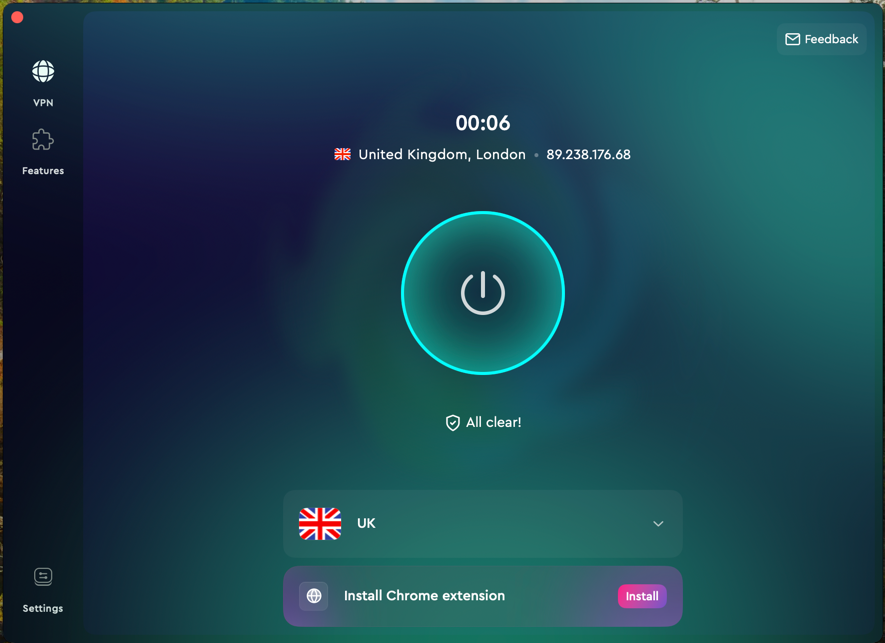

# Load Balancer

> Set up load balancer on nginx that will have 1 server for UK, 2 servers for US, and 1 server for the rest.
> 
> In case of failure, it should send all traffic to backup server. Health check should happen every 5 seconds
> 
> *Please use ngrok and touch vpn chrome extension

## Run the Ngrok

````bash
ngrok http http://localhost:8086
````


## VPN

### I Used the CleanVPN from MacPaw

## Test Rest server


## Test UK server




## Test US server


